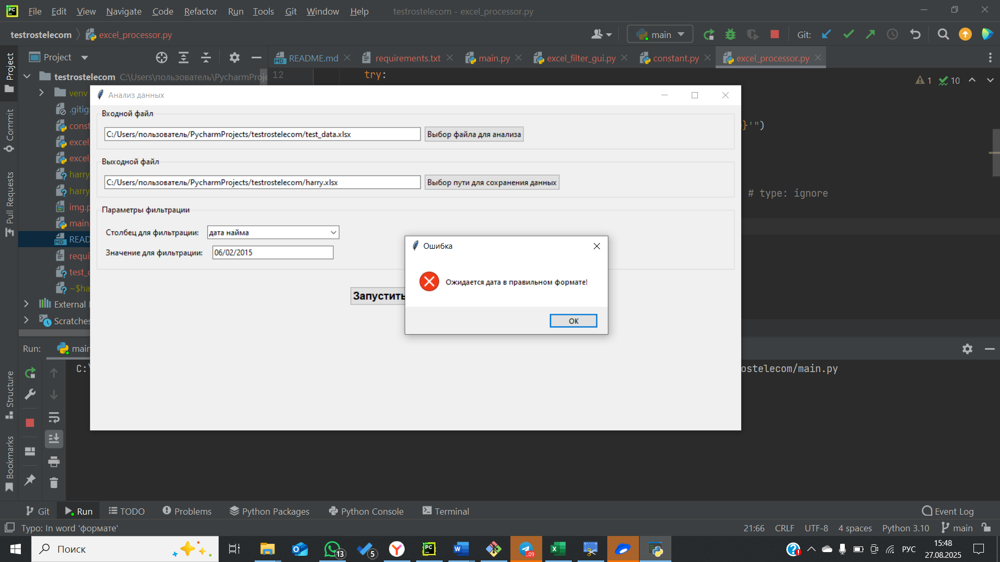

# Excel-фильтр с GUI

Кроссплатформенный Python-скрипт с графическим интерфейсом (Tkinter) для фильтрации Excel-файлов по значению
в заданном столбце и последующего сохранения результата в новый файл.

## Задача

1. Открыть Excel-файл, выбранный пользователем.  
2. Отфильтровать строки, где значение в указанном столбце **регистронезависимо** совпадает с заданным.  
3. Оставить только колонки: **ФИО, Должность, Отдел, Дата найма, Зарплата**.  
4. Сохранить результат в новый `.xlsx`-файл, заданный пользователем.  

## Функционал

- Регистронезависимая фильтрация.  
- Полная кроссплатформенность (Windows / Linux).  
- Используются только `openpyxl` и стандартная библиотека Python.  
- Удобный GUI на Tkinter.
- Валидация ввода данных для фильтрации: в столбец содержащий числа нельзя записать строку, ввода даты только
в правильном формате и т.д.

## Установка

1. Склонируйте или скачайте архив проекта.
   ```bash
   git clone https://github.com/Artur290795/testrostelecom.git

2. Создайте виртуальную среду (необязательно, но рекомендуется):
   ```bash
   python -m venv venv
   source venv/bin/activate         # Linux / macOS
   venv\Scripts\activate.bat        # Windows

3. Установите зависимости:
    ```bash
    pip install -r requirements.txt

Содержимое requirements.txt: et_xmlfile==2.0.0
openpyxl==3.1.5

4. Запуск:
    ```bash
    python main.py

